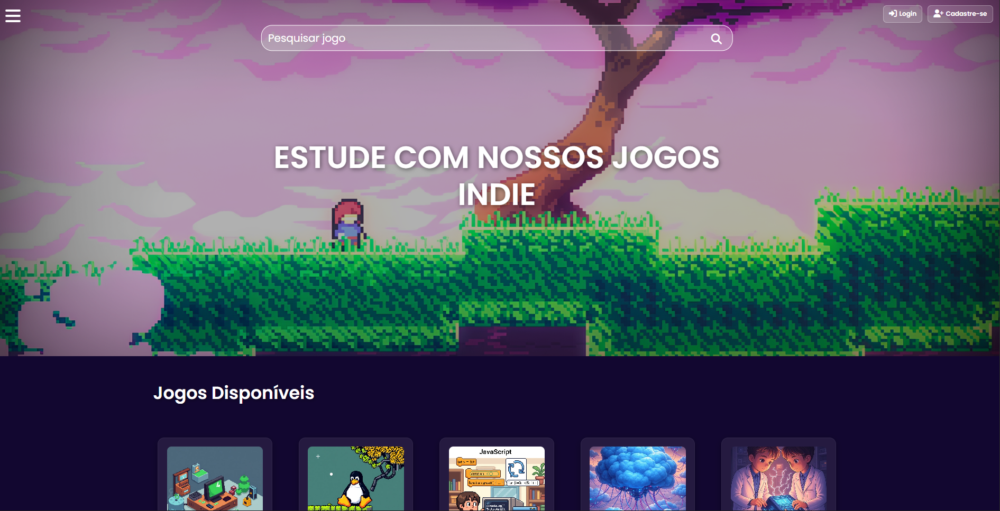
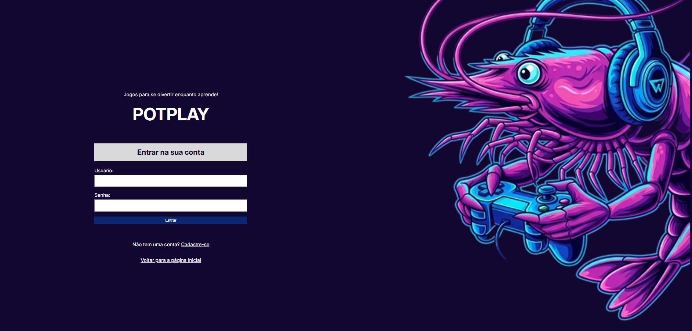
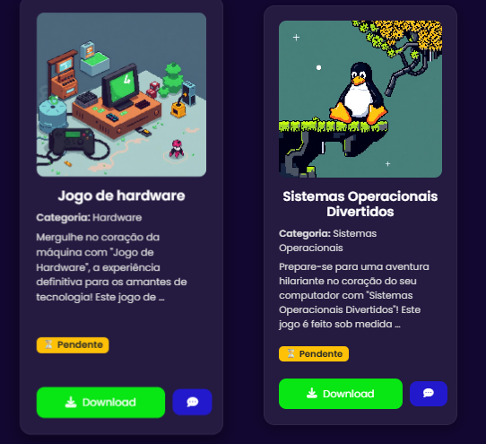
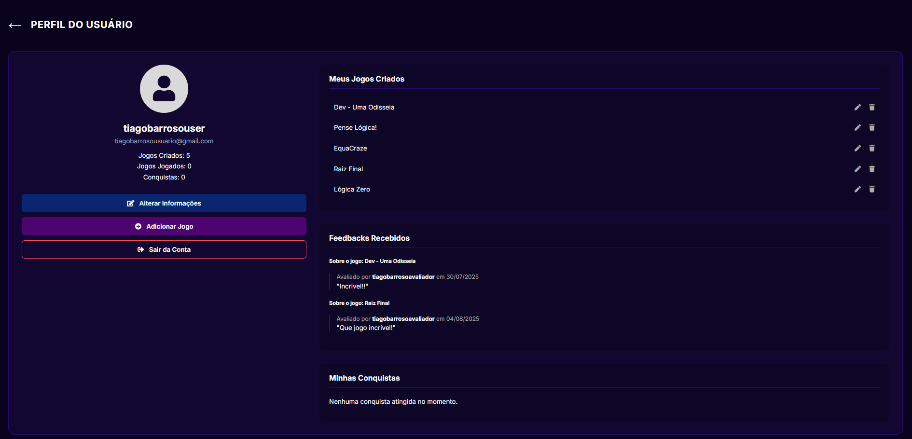

# POTPLAY

 

O projeto potplay foi desenvolvido por Tiago Barroso e Gabryell Gonçalves durante a disciplina de desenvolvimento web backend do IFRN de Canguaretama, pelo curso de Tecnologia em Sistemas para Internet. 

A ideia surgiu a partir da visualização da necessidade de integração entre os cursos do campus em projetos conjuntos com objetivos em comum. Considerando isto, a plataforma de distribuição de jogos Potplay foi
pensada para servir como intermédio para este propósito, auxiliando professores e alunos a trabalharem em projetos com visibilidade em seus campus. Para além deste intermédio também podem ser citados os
beneficios do estímulo à prática de projetos independentes por parte dos alunos, bem como a disponibilização de novas ferramentas gamificadas para que discentes e doscentes possam utilizá-las gratuitamente
em sala de aula.

## Tecnologias

Backend: Python 3.x (Django)
Banco de desenvolvimento: SQLite (db.sqlite3 incluído no repositório)
Static/media: HTML/CSS + diretório media/
Dependências: listadas em requirements.txt

## Imagens da plataforma

## Como rodar o projeto?
Quickstart — desenvolvimento local (rápido)

> Crie um ambiente virtual

python -m venv .venv
source .venv/bin/activate (Windows: .venv\Scripts\activate)

> Instale dependências

pip install -r requirements.txt

> Configuração básica (opcional)

Verifique projetopotplay/settings.py para variáveis hardcoded (SECRET_KEY, DEBUG, DATABASES).
Prefira configurar SECRET_KEY e outros via variáveis de ambiente.

> Migrar banco (quando usar banco limpo)

python manage.py migrate

> Criar superusuário (opcional)

python manage.py createsuperuser

> Rodar servidor

python manage.py runserver

## Estrutura

- manage.py — utilitário Django de gerenciamento

- projetopotplay/ — pacote do projeto (settings, urls, wsgi/asgi)

- potplayapp/ — app Django com lógica do domínio (models, views, templates)

- media/ — arquivos de mídia/uploads

- db.sqlite3 — banco SQLite (fornecido)

- requirements.txt — dependências Python

## Próximos Passos...

- Gerar documentação detalhada por módulo (MODULES.md).

- Criar SETUP.md com instruções completas e docker-compose.

- Adicionar CI (GitHub Actions) com lint e testes.

- Corrigir problemas de segurança (db, secrets).

